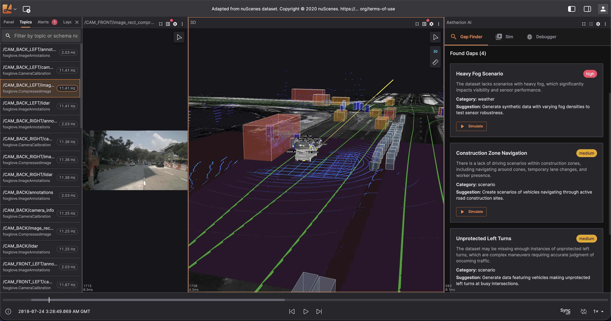
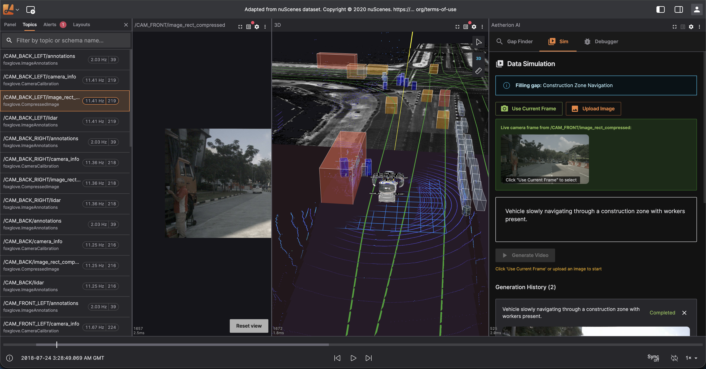
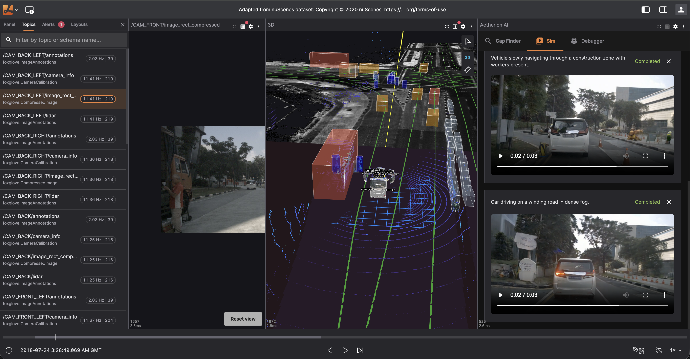

# Aetherion AI

**AI-powered autonomous vehicle data analysis platform for the Gemini 3 Hackathon**

Aetherion AI transforms how robotics engineers analyze, debug, and augment their autonomous vehicle datasets using Google's Gemini 3 API.

<p align="center">
  
</p>
<p align="center">
  
</p>
<p align="center">
  
</p>

## The Problem

Autonomous vehicle development teams face three critical challenges:

1. **Data Gaps**: Real-world driving datasets are expensive to collect and often miss edge cases (rain, night driving, construction zones). Engineers don't know what scenarios are missing until failures occur in production.

2. **Debugging Complexity**: When an AV behaves unexpectedly, engineers must manually sift through thousands of sensor messages (LiDAR, cameras, IMU, GPS) to understand what happened. This takes hours or days.

3. **Synthetic Data Generation**: Creating realistic training data for missing scenarios requires expertise in multiple tools and manual prompt engineering.

## The Solution

Aetherion AI is a visualization platform with an integrated AI panel that uses **Gemini 3** to solve all three challenges:

### 1. Gap Finder (Gemini 3)
Analyzes your dataset's topic structure and identifies missing driving scenarios using Gemini 3's reasoning capabilities.

**How Gemini 3 is used:**
- Receives dataset metadata (topics, duration, sensor types)
- Uses advanced reasoning to identify coverage gaps
- Generates simple, actionable prompts for synthetic data generation
- Outputs structured JSON for seamless UI integration

```
Input: 41 topics, 45s duration, camera/LiDAR/radar sensors
Output: "Missing: Night driving scenarios, Heavy rain conditions, Construction zone navigation"
```

### 2. Data Simulation (NVIDIA Cosmos Predict2)
Generates synthetic driving videos to fill identified gaps.

**How it works:**
- Captures live camera frames from your ROS bag data
- Combines frame + AI-generated prompt from Gap Finder
- Sends to Cosmos Predict2 Video2World model
- Returns realistic synthetic driving video

### 3. AI Debugger (Gemini 3)
Natural language interface for analyzing sensor data at any timestamp.

**How Gemini 3 is used:**
- Receives live sensor data (pose, velocity, IMU, camera annotations, LiDAR points)
- Engineers ask questions in plain English: "Why did the vehicle brake suddenly?"
- Gemini 3 analyzes actual sensor values and provides technical explanations
- Supports follow-up questions for deep debugging

```
Q: "Is the IMU data normal at this timestamp?"
A: "The IMU shows angular velocity of (0.02, -0.01, 0.15) rad/s which indicates
    a gentle right turn. Linear acceleration of (0.5, 0.1, 9.8) m/s² shows mild
    braking with normal gravity. These values are within expected ranges for
    urban driving at ~30 km/h."
```

## Architecture

```
┌─────────────────────────────────────────────────────────────┐
│                     Aetherion AI Panel                       │
├───────────────┬───────────────────┬─────────────────────────┤
│   Gap Finder  │   Data Simulation │      AI Debugger        │
│               │                   │                         │
│  ┌─────────┐  │  ┌─────────────┐  │  ┌───────────────────┐  │
│  │ Gemini 3│  │  │Camera Frame │  │  │  Live Sensor Data │  │
│  │   API   │  │  │  Capture    │  │  │  (pose, IMU, etc) │  │
│  └────┬────┘  │  └──────┬──────┘  │  └─────────┬─────────┘  │
│       │       │         │         │            │            │
│       ▼       │         ▼         │            ▼            │
│  Gap Analysis │  Cosmos Predict2  │       Gemini 3          │
│    + Prompts  │  Video Generation │    Reasoning Engine     │
└───────────────┴───────────────────┴─────────────────────────┘
                              │
                              ▼
              ┌───────────────────────────────┐
              │   Lichtblick Visualization    │
              │   (ROS bag playback, 3D view, │
              │    plots, image panels)       │
              └───────────────────────────────┘
```

## Gemini 3 Integration Details

### Features Used

| Feature | Usage |
|---------|-------|
| **Text Generation** | Gap analysis, debugging responses |
| **Structured Output (JSON)** | Gap cards with title, severity, category, prompts |
| **Long Context** | Processes full sensor data dumps (1000+ lines) |
| **Reasoning** | Root cause analysis, anomaly detection |
| **Low Latency** | Real-time debugging responses |

### API Configuration

```javascript
// Gap Finder - Creative analysis
{
  model: "gemini-3-flash-preview",
  temperature: 0.7,
  maxOutputTokens: 2048
}

// Debugger - Precise technical analysis
{
  model: "gemini-3-flash-preview",
  temperature: 0.3,
  maxOutputTokens: 4096
}
```

### Sample Prompts

**Gap Finder:**
```
You are an autonomous vehicle data analyst. Identify missing driving scenarios
in this dataset. Dataset: 41 topics, 45s duration. Find 3-5 gaps with simple
video generation prompts like "Car driving on a rainy highway at night".
```

**Debugger:**
```
You are an AV systems debugger. Live sensor data at timestamp 2.25s:
[/ego_pose] pos:(1547.23, 892.45, 0.12), vel:(8.2, 0.1, 0.0)
[/imu] accel:(0.5, 0.1, 9.8), gyro:(0.02, -0.01, 0.15)
[/CAM_FRONT/annotations] 12 detection points

User question: "Why did the vehicle slow down?"
Analyze the actual sensor values and explain.
```

## Quick Start

```bash
# Clone the repository
git clone https://github.com/samadon1/aetherion-ai.git
cd aetherion-ai

# Enable corepack
corepack enable

# Install dependencies
yarn install

# Start development server
yarn web:serve
```

Open http://localhost:8080 in your browser.

### Configuration

1. Add the **AetherionAI** panel from the panel list
2. Click the settings gear icon
3. Configure:
   - **Gemini API Key**: Your Gemini 3 API key from [Google AI Studio](https://aistudio.google.com/)
   - **Simulation Endpoint**: Cosmos Predict2 API endpoint

## Demo Video

[Link to 3-minute demo video]

## Tech Stack

- **Frontend**: React, TypeScript, Material-UI
- **Visualization**: Lichtblick (fork of Foxglove Studio)
- **AI**: Google Gemini 3 API
- **Video Generation**: NVIDIA Cosmos Predict2 Video2World
- **Data Formats**: ROS bags, MCAP files

## Built On

This project is built on [Lichtblick](https://github.com/Lichtblick-Suite/lichtblick), an open-source robotics visualization tool. Lichtblick originated as a fork of [Foxglove Studio](https://github.com/foxglove/studio).

## License

Mozilla Public License 2.0 (MPL-2.0)

---

**Built for the Gemini 3 Hackathon by Samuel Donkor**
